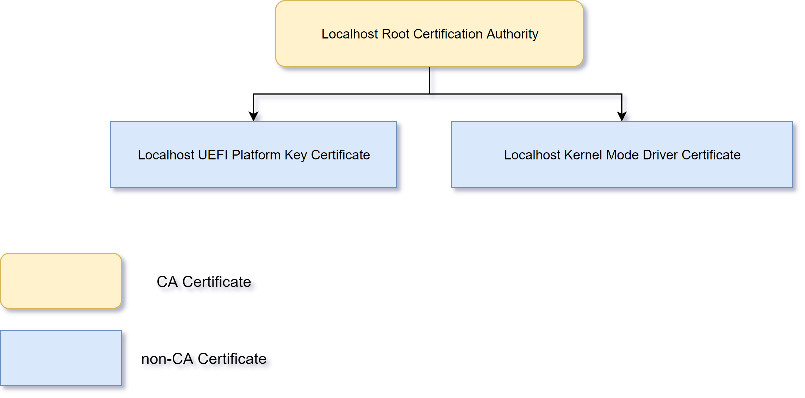

# [Create certificates](https://github.com/HyperSine/Windows10-CustomKernelSigners/blob/master/asset/build-your-own-pki.md)



**Original Source:** [HyperSine/Windows10-CustomKernelSigners](https://github.com/HyperSine/Windows10-CustomKernelSigners/blob/master/asset/build-your-own-pki.md)

## 1. Create A Root CA Certificate

A root CA certificate is the root of trust. Once a root CA certificate is trusted, all certificates issued by the root CA certificate will be trusted as well, except those certificates in CA's CRL (Certificate Revoke List). CRL is not of concern here.

Run "Windows Powershell" as Administrator:

```powershell
$cert_params = @{
    Type = 'Custom'
    Subject = 'CN=Localhost Root Certification Authority'
    FriendlyName = 'Localhost Root Certification Authority'
    TextExtension = '2.5.29.19={text}CA=1'
    HashAlgorithm = 'sha512'
    KeyLength = 4096
    KeyAlgorithm = 'RSA'
    KeyUsage = 'CertSign','CRLSign'
    KeyExportPolicy = 'Exportable'
    NotAfter = (Get-Date).AddYears(100)
    CertStoreLocation = 'Cert:\LocalMachine\My'
}
# Self Sign the Certificate
$root_cert = New-SelfSignedCertificate @cert_params
```

where

1. `TextExtension`

   * `2.5.29.19` is the OID that represents `Basic Constraints`.

   * `CA=1` indicates that new certificate is a CA certificate.

   * Of course, you can add `&pathlength=x` following `CA=1` where `x` represents the number of intermediate CA certificates that may follow in a valid certification path.

     For example, if you add `&pathlength=2`, it means a valid certification path could only at most as long as

     ```powershell
     [+] "Localhost Root Certification Authority"
      |- [+] "Intermediate CA 1"
          |- [+] "Intermediate CA 2"
     ```

     If there's `Intermediate CA 3` issued by `Intermediate CA 2`, it will not be trusted. Of course, `Intermediate CA 2` can still issue non-CA certificates.

     If `pathlength` is not specified, there's no length-limit for a valid certification path.

   * `New-SelfSignedCertificate` cmdlet creates a self-signed certificate mainly for testing purposes but here, we have our use case.

After the two commands, press `Win + R` and open `certlm.msc` to see the newly-generated certificates in `Personal\Certificates` with private key and in `Intermediate Certification Authority\Certificates` without private key.

[We need to move the latter certificates](Moving-CA-to-Trust.md) to `Trusted Root Certification Authority\Certificates` area to trust it.

## 2. Create Kernel Mode Code-Sign Certificate

We use the newly-generated root CA certificate to issue a non-CA certificate that will be used to sign all kernel mode drivers.

```powershell
$cert_params = @{
    Type = 'CodeSigningCert'
    Subject = 'CN=Localhost Kernel Mode Driver Certificate'
    FriendlyName = 'Localhost Kernel Mode Driver Certificate'
    TextExtension = '2.5.29.19={text}CA=0'
    Signer = $root_cert
    HashAlgorithm = 'sha256'
    KeyLength = 2048
    KeyAlgorithm = 'RSA'
    KeyUsage = 'DigitalSignature'
    KeyExportPolicy = 'Exportable'
    NotAfter = (Get-Date).AddYears(10)
    CertStoreLocation = 'Cert:\LocalMachine\My'
}
# Self Sign the Certificate
$km_cert = New-SelfSignedCertificate @cert_params
```

After the two commands, you can open `certlm.msc` and see newly-generated certificate in `Personal\Certificates` with private key.

## 3. Create UEFI Platform Key Certificate

We use the newly-generated root CA certificate to issue a non-CA certificate that will be used as UEFI Platform Key.

```powershell
$cert_params = @{
    Type = 'Custom'
    Subject = 'CN=Localhost UEFI Platform Key Certificate'
    FriendlyName = 'Localhost UEFI Platform Key Certificate'
    TextExtension = '2.5.29.19={text}CA=0'
    Signer = $root_cert
    HashAlgorithm = 'sha256'
    KeyLength = 2048
    KeyAlgorithm = 'RSA'
    KeyUsage = 'DigitalSignature'
    KeyExportPolicy = 'Exportable'
    NotAfter = (Get-Date).AddYears(10)
    CertStoreLocation = 'Cert:\LocalMachine\My'
}
# Self Sign the Certificate
$pk_cert = New-SelfSignedCertificate @cert_params
```

Again, you can open `certlm.msc` and see newly-generated certificate in `Personal\Certificates` with private key.

## 4. Export certificates

1. press `Win + R` and open `certlm.msc`
2. Export three certificates we just generated in `Personal\Certificates`
3. Right Click on Certificates one at a time, "All Tasks > Export" Option.
4. Export each Certificate with the private key as well as without the private key option.
5. Rename the export file name based on the following list.
6. Write down the password you set for each Certificate with the Private Key you export.

You should have the following files saved in the local drive you selected:

```js
// self-signed root CA certificate
localhost-root-ca.cer
localhost-root-ca.pfx

// kernel mode certificate issued by self-signed root CA
localhost-km.cer
localhost-km.pfx

// UEFI Platform Key certificate issued by self-signed root CA
localhost-pk.cer
localhost-pk.pfx
```

### Notes

1. `*.cer` and `*.der` both are valid formats which will work for public key.
2. `*.der` or `*.cer` are DER-encoded certificate files without private key.
3. `*.pfx` are certificate files with private key.

---
